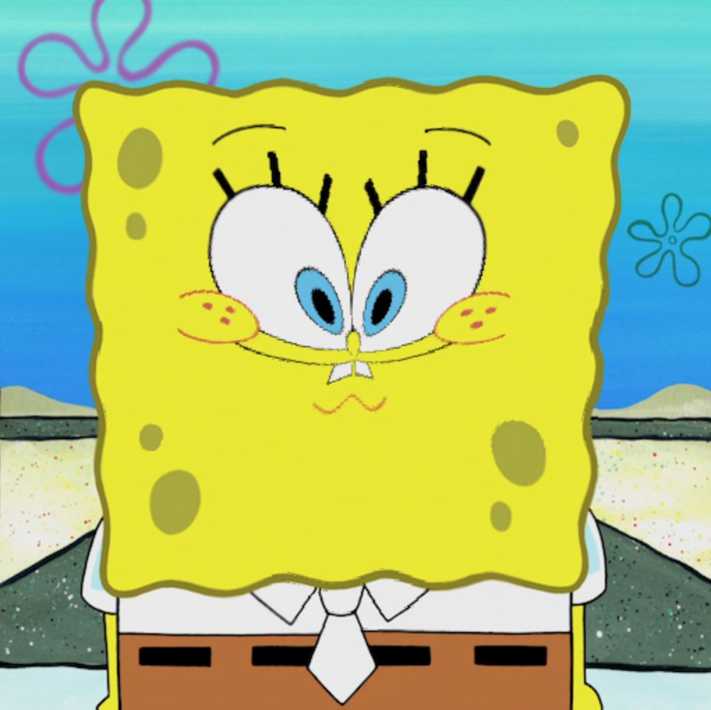

# Exercise: Binge and Pincushion Effects
In this exercise, you will implement two image distortion techniques, bulge and pincushion, illustrated below:

Original | Bulge                      |  Pincushion
:-------------------------:|:-------------------------:|:-------------------------:
 |  | 

Tasks:

1. Add uniform variables `strength` and `radius`, and bind them to the respective sliders. 
* `radius` is the bulge/pincushion filter radius ranging from 0 to 1
* `strength` is the strength of the filter ranging from -1 to 1. Strengths greater than 0 indicate the use of bulge, and strengths below 0 correspond to the pincushion filter. The larger the absolute strength value, the stronger the distortion.

2. Implement bulge and pincushion effects with respect to the center of the image (`vec2(0.5, 0.5)`). There is no general formula for the bulge/pincushion distortions, so there can be multiple valid implementations. Keep these in mind when working on the logic:
* The distortion effect only applies to pixels within the specified radius, and pixels outside the filter range should be unaffected (i.e. in the fragment shader, you should calculate the distance between a pixel and the image center, and only apply the filter if the distance is no greater than the filter radius).
* For bulge, the closer the pixels are to the image center, the more distorted they appear, as can be seen in the middle image where the nose is extremely large. Consider something like multiplying the coordinates by the **fraction** between `distance(coord, image_center)` and the filter radius. You will need to add something else for it to work as described, and you may find the [mix function](https://thebookofshaders.com/glossary/?search=mix) handy.
* Pincushion has a similar behavior as bulge in that the pixels closer to the center are more distorted. Consider using `pow(fraction, n)` where `n` is some positive value proportional to the filter strength and fraction is described in the bullet point above.
* When `strength=0`, changing the radius should not affect the image, i.e. the **fraction** should always be 1.

3. Set `radius=1` and `strength=-1`. What do you observe about the default behavior of texture wrapping? Modify the wrapping to clamp at the edge using `gl.texParameteri(...)` (refer to Lecture 5 Exhibit 1).

Extra features:
1. Read the lecture notes on interactions. Now change the `radius` control to use mouse dragging within the texture viewframe, i.e. dragging in the window from left to right changes the `radius` from 0 to 1. Also change `strength` control to use mouse scrolling within the texture frame. Hint: Mouse dragging detection can be achieved using a combination of `mousedown` and `mouseup`.

2. The distortion causes some aliasing. Enable linear interpolation and mipmapping filters to make it smoother.
